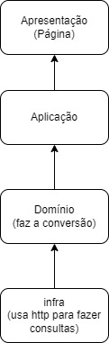
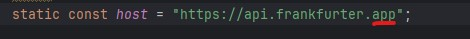

# Conversor de moedas

#Feito
Aplicativo Flutter que consulta a API pública de moedas para obter as taxas de câmbio atualizadas e permitir ao usuário converter entre diferentes moedas.

#Arquitetura

- A figura acima corresponde à organização de código implementada, em que a camada de apresentação é a base da página com os widgets do flutter, que chama a aplicação que trata o dado, criando a lista. A camada de domínio(domain) é onde fica a definição da nossa classe Moeda. E a infra, é a camada em que tratamos os erros de requisição bem como a requisição http.

#Dificuldades

- Na url possuía um / a mais ("https://api.frankfurter.app/") que demorou ser percebido gerando o erro 404, sendo que a função "get()" ja fica encarregada de fazer a requisição apenas com o endpoint.

# Tecnologies

- IDE: intellij community
- Linguagem: Dart
- Framework: Flutter
